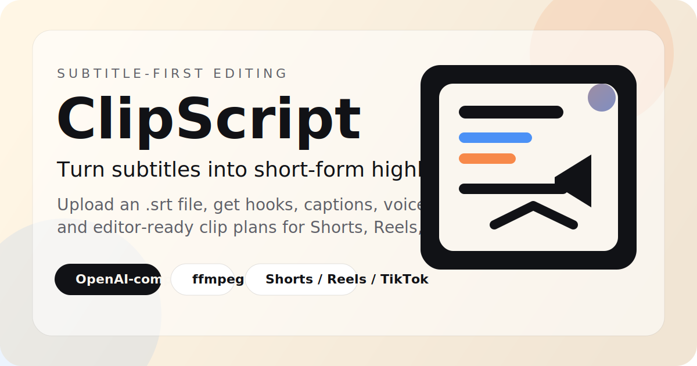
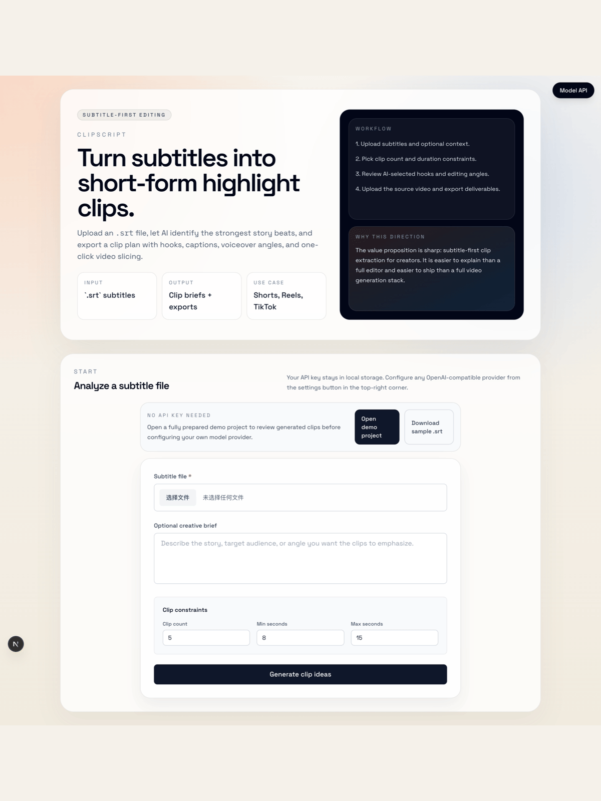
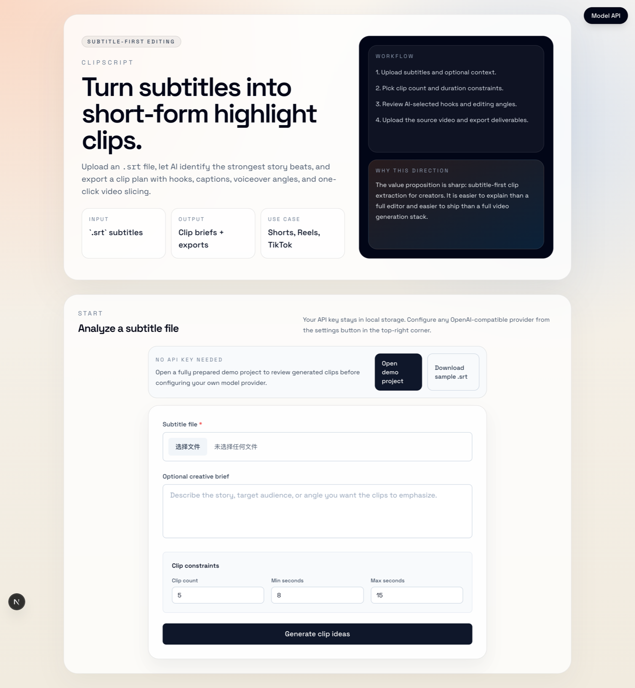
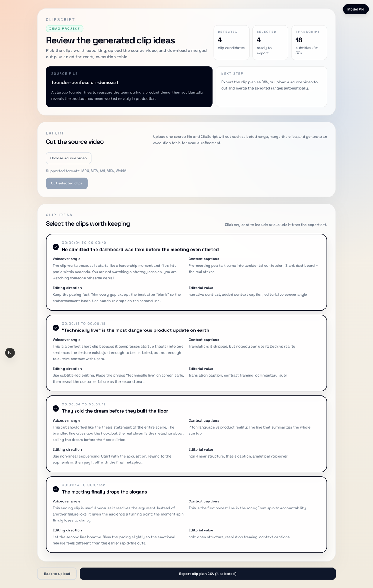

<p align="center">
  
</p>

<p align="center">
  <a href="https://github.com/a77ming/clipscript/blob/main/README.md">English</a>
  ·
  <a href="https://github.com/a77ming/clipscript/blob/main/README.zh-CN.md">简体中文</a>
</p>

<p align="center">
  <a href="https://github.com/a77ming/clipscript/actions/workflows/ci.yml"></a>
  <a href="https://github.com/a77ming/clipscript"></a>
  <a href="./LICENSE"></a>
  
</p>

# ClipScript

Turn subtitle files into short-form clips with AI-generated edit briefs and one-click exports.

`ClipScript` is a subtitle-first editing tool for creators. You upload an `.srt` file, set clip constraints, and let AI propose the strongest moments to cut into Shorts, Reels, or TikTok videos. After review, you can upload the source video and export merged clips plus an execution table.

## Demo



## Why it is useful

- Clear input: subtitle files or transcripts already used in many editing workflows
- Clear output: clip ideas with timestamps, hooks, captions, and editing direction
- Low setup cost: OpenAI-compatible API plus local `ffmpeg`
- Good for creators, editors, podcast teams, interview channels, and educational content

## Try the demo

- Start the app locally, then open the built-in demo project with no API call required:
  `http://localhost:3000/preview?demo=1`
- Or inspect the sample subtitle file:
  [`public/examples/founder-confession-demo.srt`](./public/examples/founder-confession-demo.srt)

## Screenshots

### Home



### Clip review



## What ClipScript generates

- Suggested clip ranges
- Hook subtitles for the opening beat
- Captions and emphasis ideas
- Voiceover angle for commentary-style edits
- Editing direction for pacing, framing, and sequencing
- CSV execution table for editors and operators

## Typical use cases

- Podcast episode clipping
- Interview and talk highlights
- Drama or story recap moments
- Course snippets and educational highlights
- Commentary and reaction workflows that start from subtitles

## Current capabilities

- Subtitle-first highlight discovery from `.srt`
- AI-generated hook, title, captions, voiceover angle, and editing direction
- Adjustable clip count and duration range
- OpenAI-compatible model API support
- Source-video upload and one-click clip export
- Execution table export for editors and operators

## Workflow

```text
.srt subtitles
  -> AI selects strong moments
  -> hook / caption / voiceover suggestions
  -> human review
  -> source video upload
  -> clip exports + execution table
```

## Quick start

### Requirements

- Node.js 20+
- `ffmpeg` installed and available in `PATH`

### Local development

```bash
git clone https://github.com/a77ming/clipscript.git
cd clipscript
npm install
cp .env.example .env
npm run dev
```

Open `http://localhost:3000`.

Then:

1. Click the `Model API` button in the top-right corner
2. Paste your API key
3. Set a compatible base URL and model if needed
4. Upload an `.srt` file
5. Review the generated clip ideas
6. Upload the source video on the preview page to export deliverables

## Docker

```bash
docker compose up -d --build
```

## Project status

ClipScript is maintained as an active public repository with:

- CI on push and pull request
- contributor guidelines and issue templates
- published release notes, including [`v0.1.1`](./docs/releases/v0.1.1.md)
- maintainer ownership defined in [`CODEOWNERS`](./.github/CODEOWNERS) and [`MAINTAINERS.md`](./MAINTAINERS.md)
- support and disclosure paths in [`SUPPORT.md`](./SUPPORT.md) and [`SECURITY.md`](./SECURITY.md)

## Configuration

Environment variables are optional. The browser UI is the main configuration surface.

```bash
API_BASE_URL=https://api.openai.com/v1
API_MODEL=gpt-4o-mini
```

## Roadmap

- Better preview and approval flow
- Transcript support beyond `.srt`, including `.vtt` and plain text
- Batch jobs for creators with episode libraries
- Stronger paper-edit exports for editors
- Desktop packaging as a future follow-up once the web workflow is stable

## Project health

- Release notes: [`docs/releases/v0.1.0.md`](./docs/releases/v0.1.0.md)
- Changelog: [`CHANGELOG.md`](./CHANGELOG.md)
- Maintainer info: [`MAINTAINERS.md`](./MAINTAINERS.md)
- Support guide: [`SUPPORT.md`](./SUPPORT.md)
- OpenAI application fill guide: [`docs/openai-application-fill-guide.md`](./docs/openai-application-fill-guide.md)
- OpenAI OSS application draft: [`docs/openai-oss-application.md`](./docs/openai-oss-application.md)
- OpenAI credits usage plan: [`docs/openai-credits-plan.md`](./docs/openai-credits-plan.md)

## Looking for contributions

ClipScript is still early, but the contribution surface is already clear. Useful help right now includes:

- transcript import support for `.vtt` and plain text
- evaluation fixtures and regression checks for clip quality
- preview and approval UX before export
- packaging and cross-platform workflow polish
- docs improvements for contributors and creators

## Contributing

See [`CONTRIBUTING.md`](./CONTRIBUTING.md).

## Support

See [`SUPPORT.md`](./SUPPORT.md).

## Notes

- API keys are stored in local browser storage.
- This project expects an OpenAI-compatible API.
- `ffmpeg` is required for actual video slicing and merging.
- `deploy.sh` is a template and requires deployment credentials via environment variables.

## License

MIT
